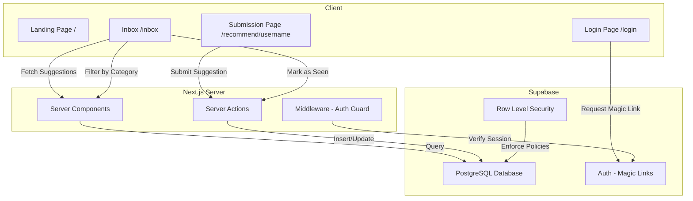

# Design Document: MyReccBox

## Overview

MyReccBox is a Next.js 14 App Router application that allows users to collect recommendations from friends in a centralized inbox. The system has two primary surfaces:

1. **Public Submission Page** (`/recommend/[username]`) — A form-based page where anyone can submit a recommendation without authentication.
2. **Private Inbox** (`/inbox`) — An authenticated view where the owner reviews, filters, and tracks suggestions.

The application uses Supabase for both the PostgreSQL database and magic link authentication, Tailwind CSS for styling, and TypeScript throughout.

### Key Design Decisions

- **Server Components by default**: Pages use React Server Components for data fetching, with Client Components only where interactivity is needed (forms, filters, mark-as-seen).
- **Server Actions for mutations**: Form submissions and state updates use Next.js Server Actions to keep API surface minimal.
- **Supabase Row Level Security (RLS)**: The suggestions table uses RLS policies so that public inserts are allowed but reads/updates are restricted to the authenticated owner.
- **No user registration flow**: The app supports a single owner (or a small set of owners). User records are seeded or created via Supabase dashboard. The public submission page resolves usernames against a `profiles` table.

## Architecture



### Request Flow

1. **Submission**: Sender visits `/recommend/[username]` → Server Component validates username exists → Client Component renders form → Server Action inserts row into `suggestions` table.
2. **Inbox Load**: Owner visits `/inbox` → Middleware checks auth → Server Component fetches paginated suggestions → renders suggestion cards.
3. **Mark as Seen**: Owner clicks unseen card → Client Component calls Server Action → updates `seen` field → optimistic UI update with error rollback.
4. **Filter**: Owner clicks category filter → Client-side state update triggers re-fetch with category parameter → Server Component returns filtered results.

## Components and Interfaces

### Pages

| Route | Type | Auth Required | Description |
|-------|------|---------------|-------------|
| `/` | Server Component | No | Landing page with hero and demo CTA |
| `/recommend/[username]` | Server + Client Component | No | Public suggestion submission form |
| `/login` | Client Component | No | Magic link login form |
| `/inbox` | Server + Client Component | Yes | Suggestion inbox with filters |

### Core Components

```typescript
// Submission Form (Client Component)
interface SubmissionFormProps {
  username: string;
  userId: string;
}

// Suggestion Card (Client Component for click handling)
interface SuggestionCardProps {
  suggestion: Suggestion;
  onMarkSeen: (id: string) => Promise<void>;
}

// Category Filter Bar (Client Component)
interface CategoryFilterProps {
  categories: Category[];
  activeCategory: Category | 'all';
  onFilterChange: (category: Category | 'all') => void;
}

// Pagination Controls (Client Component)
interface PaginationProps {
  currentPage: number;
  totalPages: number;
  onPageChange: (page: number) => void;
}
```

### Server Actions

```typescript
// Submit a new suggestion
async function submitSuggestion(formData: FormData): Promise<ActionResult>;

// Mark a suggestion as seen
async function markSuggestionSeen(suggestionId: string): Promise<ActionResult>;
```

### Data Access Functions

```typescript
// Validate that a username exists, return userId
async function resolveUsername(username: string): Promise<string | null>;

// Fetch paginated suggestions for the authenticated owner
async function getSuggestions(params: {
  userId: string;
  category?: Category;
  page: number;
  pageSize: number;
}): Promise<PaginatedResult<Suggestion>>;

// Insert a new suggestion
async function createSuggestion(data: NewSuggestion): Promise<Suggestion>;

// Update seen status
async function updateSuggestionSeen(id: string, userId: string): Promise<void>;
```

## Data Models

### Types

```typescript
type Category = 'Book' | 'Movie' | 'Show' | 'Restaurant' | 'Other';

interface Suggestion {
  id: string;           // UUID
  created_at: string;   // ISO timestamp
  user_id: string;      // UUID - owner of the suggestion
  name: string;         // Sender name, max 100 chars
  category: Category;
  title: string;        // Suggestion title, max 200 chars
  notes: string | null; // Optional notes, max 500 chars
  seen: boolean;        // Default false
}

interface NewSuggestion {
  user_id: string;
  name: string;
  category: Category;
  title: string;
  notes?: string;
}

interface PaginatedResult<T> {
  data: T[];
  total: number;
  page: number;
  pageSize: number;
  totalPages: number;
}

interface ActionResult {
  success: boolean;
  error?: string;
}

interface Profile {
  id: string;           // UUID, matches auth.users.id
  username: string;     // Unique, used in URL
}
```

### Database Schema

```sql
-- Profiles table (maps usernames to auth users)
CREATE TABLE profiles (
  id UUID PRIMARY KEY REFERENCES auth.users(id),
  username TEXT UNIQUE NOT NULL
);

-- Suggestions table
CREATE TABLE suggestions (
  id UUID PRIMARY KEY DEFAULT gen_random_uuid(),
  created_at TIMESTAMPTZ NOT NULL DEFAULT now(),
  user_id UUID NOT NULL REFERENCES profiles(id),
  name TEXT NOT NULL CHECK (char_length(name) <= 100),
  category TEXT NOT NULL CHECK (category IN ('Book', 'Movie', 'Show', 'Restaurant', 'Other')),
  title TEXT NOT NULL CHECK (char_length(title) <= 200),
  notes TEXT CHECK (notes IS NULL OR char_length(notes) <= 500),
  seen BOOLEAN NOT NULL DEFAULT false
);

-- Index for inbox queries (owner's suggestions, sorted by date)
CREATE INDEX idx_suggestions_user_created ON suggestions(user_id, created_at DESC);

-- Index for category filtering
CREATE INDEX idx_suggestions_user_category ON suggestions(user_id, category, created_at DESC);
```

### Row Level Security Policies

```sql
-- Anyone can insert suggestions (public submission)
CREATE POLICY "Public can insert suggestions"
  ON suggestions FOR INSERT
  WITH CHECK (true);

-- Only the owner can read their own suggestions
CREATE POLICY "Owner can read own suggestions"
  ON suggestions FOR SELECT
  USING (auth.uid() = user_id);

-- Only the owner can update their own suggestions
CREATE POLICY "Owner can update own suggestions"
  ON suggestions FOR UPDATE
  USING (auth.uid() = user_id);

-- Public can read profiles (for username resolution)
CREATE POLICY "Public can read profiles"
  ON profiles FOR SELECT
  USING (true);
```

## Correctness Properties

*A property is a characteristic or behavior that should hold true across all valid executions of a system — essentially, a formal statement about what the system should do. Properties serve as the bridge between human-readable specifications and machine-verifiable correctness guarantees.*

### Property 1: Submission round-trip preserves data and generates defaults

*For any* valid suggestion input (name ≤ 100 chars, category in valid set, title ≤ 200 chars, notes ≤ 500 chars or null), submitting the suggestion and then reading it back should yield a record where: the name, category, title, and notes match the input exactly; the id is a valid UUID; the created_at is a recent timestamp; and seen is false.

**Validates: Requirements 1.2, 7.2**

### Property 2: Validation rejects invalid suggestion data

*For any* suggestion input that violates at least one constraint (name empty or > 100 chars, category not in {Book, Movie, Show, Restaurant, Other}, title empty or > 200 chars, notes > 500 chars), the submission should be rejected with an error and no record should be persisted.

**Validates: Requirements 1.4, 7.1, 7.3**

### Property 3: Inbox suggestions are sorted by newest first

*For any* set of suggestions belonging to an owner, fetching them from the inbox should return them in strictly descending order of created_at timestamp.

**Validates: Requirements 2.1**

### Property 4: Notes truncation preserves content up to 200 characters

*For any* suggestion with notes, the display truncation function should: return the full notes unchanged if length ≤ 200 characters; return exactly the first 200 characters with a truncation indicator appended if length > 200 characters.

**Validates: Requirements 2.2**

### Property 5: Pagination returns at most pageSize items with correct metadata

*For any* total count of suggestions and page size of 20, fetching page N should return at most 20 suggestions, totalPages should equal ceil(total / 20), and the union of all pages should contain every suggestion exactly once.

**Validates: Requirements 2.5**

### Property 6: Marking an unseen suggestion as seen is idempotent

*For any* unseen suggestion, calling markSeen should set seen to true. Calling markSeen again on the same suggestion should leave it as seen (idempotent at the data layer). The suggestion's other fields should remain unchanged.

**Validates: Requirements 3.1, 3.3**

### Property 7: Category filter returns only matching suggestions

*For any* set of suggestions and any selected category (including "all"), the filtered result should contain exactly those suggestions whose category matches the selection (or all suggestions when "all" is selected), and no others.

**Validates: Requirements 4.2, 4.3**

### Property 8: Email validation rejects malformed addresses

*For any* string that does not conform to a valid email format (missing @, missing domain, empty string, whitespace-only), the login form validation should reject it with an error and not trigger a magic link request.

**Validates: Requirements 5.3**

## Error Handling

### Submission Errors

| Scenario | Behavior |
|----------|----------|
| Required field missing | Client-side validation prevents submission; inline error messages shown per field |
| Field exceeds max length | Client-side validation prevents submission; character count indicator shown |
| Invalid category | Should not occur with select input; server-side validation rejects if bypassed |
| Database insert failure | Server Action returns error; form preserves entered data; toast/banner shows error message |
| Username not found | Server Component returns 404-style page with "not found" message |

### Inbox Errors

| Scenario | Behavior |
|----------|----------|
| Unauthenticated access | Middleware redirects to `/login` |
| Mark-as-seen failure | Optimistic UI rolls back; error toast displayed; suggestion returns to unseen visual state |
| Fetch failure | Error boundary shows retry message |

### Authentication Errors

| Scenario | Behavior |
|----------|----------|
| Invalid email format | Client-side validation prevents submission |
| Magic link send failure | Error message displayed; user can retry |
| Expired/invalid magic link | Redirect to `/login` with error message |
| Session expired | Middleware redirects to `/login` on next protected route access |

### Error Handling Principles

1. **Preserve user input on failure** — Never clear form data when an error occurs.
2. **Optimistic UI with rollback** — For mark-as-seen, update UI immediately and roll back on failure.
3. **Graceful degradation** — Show meaningful error messages rather than generic failures.
4. **Client + Server validation** — Validate on client for UX, validate on server for security.

## Testing Strategy

### Unit Tests (Example-Based)

Unit tests cover specific scenarios, edge cases, and UI rendering:

- **Submission form rendering** — Verify all fields present with correct attributes (1.1)
- **Success state** — After successful submission, success message shown and form reset (1.3)
- **Error state** — On server error, error message shown and form data preserved (1.6)
- **Username not found** — 404 message for invalid username (1.7)
- **Empty inbox state** — Empty message when no suggestions exist (2.3)
- **Seen/unseen visual distinction** — Seen cards have reduced opacity (3.2)
- **Already-seen click** — No network request when clicking already-seen card (3.3)
- **Mark-seen error rollback** — Error toast and visual rollback on failure (3.4)
- **Filter bar default state** — "All" selected by default (4.1)
- **Empty category filter** — Message shown when no suggestions match filter (4.4)
- **Landing page content** — Headline, description, and demo button present (6.1, 6.2)
- **Demo button navigation** — Navigates to /recommend/aisha (6.3)

### Integration Tests

Integration tests verify Supabase interactions and auth flows:

- **Magic link request** — Valid email triggers Supabase sendMagicLink (5.2)
- **Magic link callback** — Valid token establishes session and redirects (5.4)
- **Expired magic link** — Invalid token redirects to login with error (5.5)
- **Logout** — Session ends and redirects to login (5.6)
- **Auth guard** — Unauthenticated inbox access redirects to login (2.4, 5.1)
- **RLS enforcement** — Owner can only read/update their own suggestions

### Property-Based Tests

Property-based tests verify universal correctness properties using `fast-check`:

| Property | Test Description | Min Iterations |
|----------|-----------------|----------------|
| Property 1 | Generate random valid suggestions, submit, read back, verify round-trip | 100 |
| Property 2 | Generate random invalid suggestions (bad lengths, bad categories), verify rejection | 100 |
| Property 3 | Generate random suggestion sets, verify descending sort order | 100 |
| Property 4 | Generate random strings of varying length, verify truncation behavior | 100 |
| Property 5 | Generate random total counts, verify pagination math | 100 |
| Property 6 | Generate random unseen suggestions, mark seen, verify idempotence | 100 |
| Property 7 | Generate random suggestion sets + random category, verify filter correctness | 100 |
| Property 8 | Generate random malformed email strings, verify validation rejects all | 100 |

**Library**: `fast-check` (TypeScript property-based testing library)
**Configuration**: Minimum 100 iterations per property, seed logged for reproducibility
**Tagging**: Each test tagged with `Feature: my-recc-box, Property {N}: {title}`

### Test Organization

```
tests/
├── unit/
│   ├── submission-form.test.tsx
│   ├── suggestion-card.test.tsx
│   ├── category-filter.test.tsx
│   ├── inbox-page.test.tsx
│   └── landing-page.test.tsx
├── integration/
│   ├── auth.test.ts
│   ├── suggestions-api.test.ts
│   └── rls-policies.test.ts
└── properties/
    ├── submission.property.test.ts
    ├── inbox-sorting.property.test.ts
    ├── truncation.property.test.ts
    ├── pagination.property.test.ts
    ├── mark-seen.property.test.ts
    ├── category-filter.property.test.ts
    └── email-validation.property.test.ts
```

